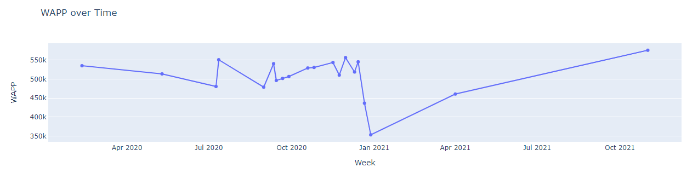
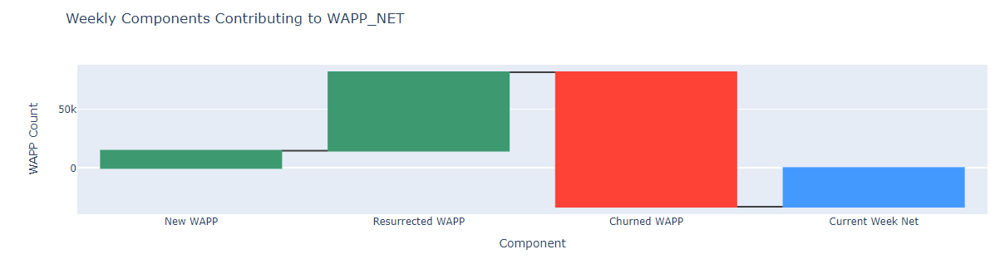
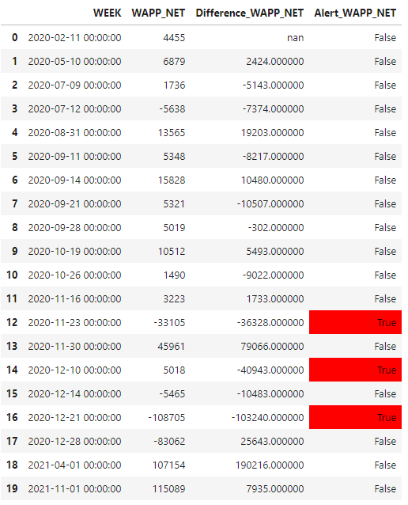

# Weekly Active Paying People (WAPP) Analysis

## Overview
This project focuses on analyzing the trends and factors affecting Weekly Active Paying People (WAPP). The primary goal is to understand the causes of fluctuations in WAPP, identify any alarming trends, and develop an automated alert system for significant changes.

## Problem Statement
We observed unexpected fluctuations in the WAPP count, including sharp increases and decreases that triggered alerts within our monitoring systems. These fluctuations necessitated a deeper analysis to determine their causes, assess the reliability of the alerts, and understand the impact of various factors such as user resurrection and churn rates.

## Analysis

### Methodology
The analysis involved several steps:
1. **Data Preprocessing**: Cleaning and preparing weekly WAPP data, including handling missing values and ensuring data integrity.
2. **Trend Analysis**: Visualizing WAPP trends over time to identify significant fluctuations.
3. **Alert Simulation**: Simulating a naive alert system to understand the conditions under which alerts were triggered.
4. **Correction Detection**: Implementing logic to differentiate genuine alerts from false alarms caused by statistical corrections.
5. **Predictive Modeling**: Discussing potential models and methodologies for predicting WAPP based on historical data.

### Tools and Libraries Used
- **Pandas** for data manipulation and analysis.
- **Plotly** for interactive and informative visualizations.

### Key Findings
- The sharp decrease followed by an immediate increase in WAPP was identified as a correction rather than a genuine drop in user engagement.
- The alert system, without correction detection, was prone to false alarms triggered by these corrections.
- Introducing correction detection logic significantly reduced false alerts, allowing for more accurate monitoring.

## Conclusions
Our analysis concluded that the fluctuations leading to the alerts were primarily due to corrections in user engagement metrics rather than actual issues needing intervention. By refining the alert system and incorporating advanced predictive modeling, we can enhance our understanding and monitoring of WAPP trends.

## Visualization
The project includes several key visualizations:
- Trend analysis over time for WAPP.

- Waterfall charts depicting the composition of WAPP changes.

- Simulated alerts to demonstrate the impact of correction detection logic.

## How to Use This Repository
1. Clone the repository to your local machine.
2. Ensure you have Python and the necessary libraries installed.
3. Run the Jupyter notebooks to replicate the analysis and explore the datasets.
